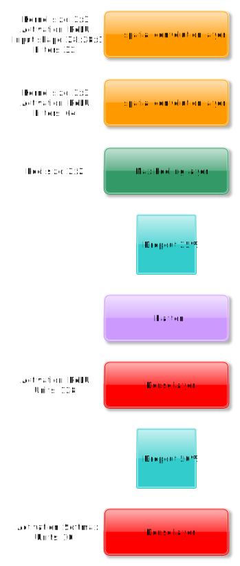

# keras-convolutional-neural-network
Simple implementation of a convolutional neural network(CNN), trained and tested on the MNIST dataset with a testing accuracy of <b>98%-99%</b> 
The problem presented to the CNN is to categorise an image with a handwritten digit.  The neural nets output is limited to 0-9.
 <h1>The architecture</h1>
 

 
<b>See comments in code</b>
